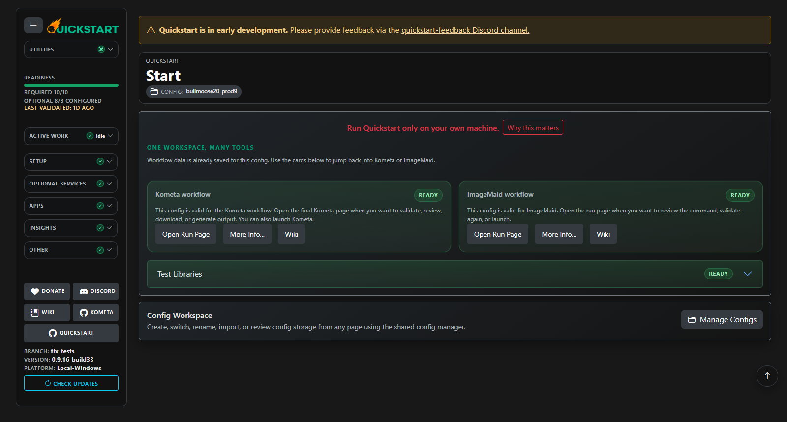
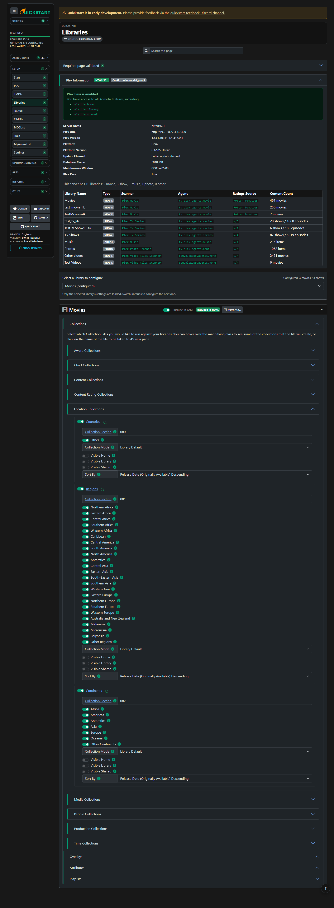
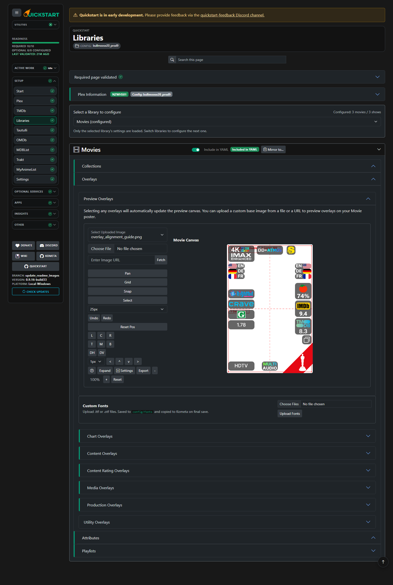
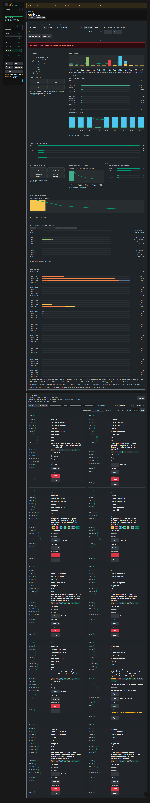
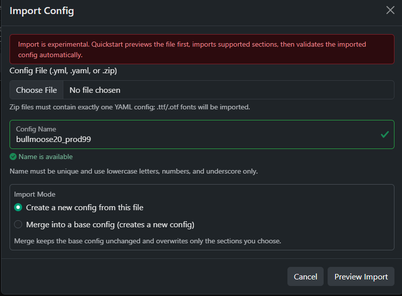

<!--logo-start-->

<!--logo-end-->
<!--shields-start-->
[](https://github.com/Kometa-Team/Quickstart/releases)
[](https://hub.docker.com/r/kometateam/quickstart)
[](https://hub.docker.com/r/kometateam/quickstart)
[](https://github.com/Kometa-Team/Quickstart/tree/develop)

[](https://discord.gg/NfH6mGFuAB)
[](https://www.reddit.com/r/Kometa/)
[](https://kometa.wiki/en/latest/home/scripts/quickstart.html)
[](https://github.com/sponsors/meisnate12)
[](https://github.com/sponsors/meisnate12)
<!--shields-end-->
<!--body1-start-->
## Welcome to Kometa Quickstart

## ✨ Features

Kometa Quickstart is more than just a YAML generator - it's a full interactive environment for configuring Kometa, running built-in Kometa-Team apps, and reviewing their results. Key features include:



### Multiple Ways to Run Quickstart
- **Local Python:** Works on Windows, macOS, and Linux
- **Frozen Builds:** Precompiled executables for Windows, macOS, and Linux (no Python required)
- **Docker Image:** Official image on Docker Hub with persistent `/config` volume support
- **Branch Support:** Choose between `master` (stable) and `develop` (bleeding-edge) branches for every runtime option

### Safe Playground Mode
- **Plex Test Libraries:** Downloadable from the start page so you can experiment without touching production libraries
- **No Risk to Production:** All Quickstart data, credentials, and configs are stored locally

### Config Management & History
- **SQLite-Backed Storage:** All configs and page data are stored in a database, so you can switch between configs at any time
- **Safe Config Switching:** Switching configs from the sidebar auto-saves the current page first, then refreshes readiness and TODO state for the selected config
- **Automatic Backups:** Every config is saved as a versioned `.yml` file for historical reference
- **Download & Run Anywhere:** Final configs can be downloaded and run outside Quickstart if preferred

### Guided, Validated Workflow
- **Step-by-Step Pages:** Each section validates its own data, giving you instant feedback before proceeding
- **Library Telemetry:** Pulls real Plex server data (Plex Pass status, library types, agent/scanner compatibility)
- **Dynamic Toggles & Templates:** Rich UI for enabling collections, overlays, and builder template variables
- **Dependency-Aware Optional Pages:** Optional pages such as Tautulli, OMDb, MDBList, AniDB, Radarr, Sonarr, Trakt, and MyAnimeList become required when selected library features need them
- **TODO Sidebar:** Outstanding dependency and validation tasks are grouped into clickable cards that save the current page and open the affected setup page
- **Library-Scoped Playlists:** Playlist file selection now lives on the Libraries page so playlists stay tied to the libraries included in the generated YAML
- **Filtered Page Search:** Find matches on Libraries and Settings pages and auto-expand matching sections
- **Settings Cog:** Quick access to runtime controls like debug mode and port changes from anywhere



### Kometa Gates
- **Fail-Fast Setup Checks:** The Kometa page stops at the TODO gate when required setup work remains instead of building YAML or checking Kometa prematurely
- **Validation Freshness:** If bulk validation is stale, Quickstart automatically runs Validate All and refreshes workspace status before continuing
- **Config Before Runtime:** Quickstart builds and validates the generated config before checking Kometa or showing run controls
- **Kometa Update Guidance:** Missing Kometa is a hard blocker, while available Kometa updates are shown as guidance without blocking the run command

### Built-in App Runners

#### Kometa
- **One-Click Execution:** The Kometa page creates a Kometa virtual environment (if needed), installs dependencies, and runs `kometa.py` against the generated config
- **Run Command Builder:** Dynamically builds and previews CLI commands with flags like `--run`, `--operations-only`, `--times`, etc.
- **Process Management:** Start, stop, and monitor Kometa runs directly from the web interface
- **Maintenance-Aware Runs:** Detects Plex maintenance windows, pauses active runs, and queues new runs until maintenance ends (with global UI badges and toasts)

This reduces the chance of Plex background maintenance colliding with long Kometa runs, keeps Plex more responsive during the window, and avoids wasting time starting a run that would immediately pause.

#### ImageMaid
- **Prepare / install / update flow:** Quickstart can install or update ImageMaid in its own managed directory before running it
- **Mode-aware validation:** The ImageMaid page validates mode-specific requirements such as restore-folder availability before a run starts
- **Guided run gating:** Run controls stay hidden until ImageMaid is installed and validated, with explicit guidance for the next required step
- **Maintenance-aware start protection:** ImageMaid starts are blocked during Plex maintenance windows instead of colliding with active maintenance


### Live Previews & Assets
- **Overlay Preview Generator:** Combines overlays and template variables into real-time preview images
- **Custom Artwork Uploads:** Drag-and-drop or fetch library images from a URL so you can see what the overlays look like on your favorite poster.



### Automatic Updates
- **Quickstart Self-Updater:** One-click update to latest master or develop branch
- **Kometa Sync:** Option to pull and update Kometa itself (nightly/master) before running

### Themes & Personalization
- **Theme Picker:** Switch between Kometa, Plex, Jellyfin, Emby, Seerr, and more with instant apply

### Analytics
- **Cross-app history:** Analytics tracks both Kometa and ImageMaid runs from Quickstart-managed runtime logs and archives
- **Reingest & analytics:** Rebuild run history from:
  - `config/kometa/config/logs`
  - `config/imagemaid/config/logs`
  - `config/cache/logscan/archive/kometa`
  - `config/cache/logscan/archive/imagemaid`
- **Stable run tracking:** Runs are deduped with a stable `run_key` and cached in `config/cache/logscan/ingest_cache.json`.
- **Missing people requests:** Deduped output is written to `config/cache/logscan/meta_people_missing.log` (metadata in `meta_people_missing.json`).
- **UI helpers:** App/config/time-range filters, sortable table headers, analytics breakdowns, and per-run “Report” recommendations.
- **Independent retention:** Kometa and ImageMaid archived logs each have their own retention setting in Quickstart Settings
- **Startup migrations:** Quickstart can perform a one-time Analytics reset + reingest on startup when a release needs historical log data rebuilt for a new feature.

#### Startup Analytics Migrations

Quickstart supports versioned one-time Analytics migrations for releases that need existing `meta*.log*` history reprocessed without requiring you to open the Analytics page manually.

- `QS_LOGSCAN_STARTUP_MIGRATIONS=1`
  Default is enabled. Set this to `0` in `config/.env` if you need to temporarily suppress automatic startup migrations.
- `QS_LOGSCAN_MIGRATION_LEVEL_DONE=0`
  Quickstart writes this value back to `config/.env` after a startup migration succeeds. It records the highest migration level already applied on that installation.
- `REQUIRED_LOGSCAN_MIGRATION_LEVEL`
  This is a code constant in `quickstart.py`. Release builds bump this integer when they need a one-time reset + reingest for a new Analytics capability.

How it works:

- On startup, Quickstart compares `QS_LOGSCAN_MIGRATION_LEVEL_DONE` with the code's `REQUIRED_LOGSCAN_MIGRATION_LEVEL`.
- If the completed level is lower, Quickstart starts a background Analytics migration that resets trend data and reingests all available supported runtime logs.
- If a user skips releases, the higher required level still triggers the migration automatically on the next startup.
- If this is a first-time Quickstart setup and no supported runtime logs exist yet, Quickstart defers the migration instead of marking it complete. The migration remains pending until logs exist on a future startup.
- If a reingest is already running, Analytics reconnects to the active job instead of starting a second one.

### Logscan Analyzer & Analytics Page
- **Logscan Analyzer:** Parses Quickstart-managed Kometa and ImageMaid runtime logs to surface errors, run summaries, and missing items.
- **Analytics Page:** Interactive dashboard for cross-app run history, scope-first filters, and per-run recommendations.



### Import Existing Config
- **Import Config:** Launch import from the Welcome page to prefill settings, libraries, and templates.
- **YAML or ZIP:** Zip files must contain exactly one YAML config; `.ttf`/`.otf` fonts in the zip will be imported.
- **Preview required:** Quickstart always runs a preview before import and shows a line‑by‑line report (`imported / not imported`) with filters (All/Imported/Not Imported/Comments) and a downloadable report.
- **Plex credentials prompt:** If the import contains libraries, Plex validation is required for mapping. Quickstart will prompt for Plex URL/token if none are present; if the credentials in the file fail validation, you’ll be prompted to correct them and re‑run Preview.
- **Library mapping:** Imported library names must be mapped to Plex libraries (or ignored) before confirming the import; you can re‑preview after mapping.
- **After import:** Quickstart stays on the Welcome page, runs bulk validation automatically, then refreshes the workspace status for the imported config.

#### What happens after import?

After you confirm an import, Quickstart saves the new config, shows a compact summary of imported sections, skipped sections, mapped libraries, and copied fonts, then runs bulk validation automatically. If validation fails for any page, Quickstart keeps the summary open with direct links to the failed pages. If validation passes, it refreshes the Welcome page with the imported config selected.



### Quickstart Scope
- **Quickstart support vs Kometa support:** The Support Info workflow is for Quickstart issues. Kometa runtime issues should be handled in Kometa support channels.

### Support & Troubleshooting
- **Support Info (every page):** Use the Support Info button to gather system info and the Quickstart log tail.
- **Redaction notice:** We attempt to redact secrets, but always review before posting.
- **Log file:** `config/logs/quickstart.log`

### Data & Privacy (Quickstart)
- **Local-first:** Config data is stored locally in SQLite and versioned `.yml` files in `config/`.
- **Network access:** Quickstart only contacts external services when you validate settings or fetch remote assets.

Kometa Quickstart is a guided Web UI that helps you create a configuration file for Kometa and run supported Kometa-Team companion apps from the same workspace.

Special thanks to [meisnate12](https://github.com/meisnate12), [bullmoose20](https://github.com/bullmoose20), [chazlarson](https://github.com/chazlarson), and [Yozora](https://github.com/yozoraXCII) for their contributions to this tool.

## Table of Contents

- [Welcome to Kometa Quickstart](#welcome-to-kometa-quickstart)
- [✨ Features](#-features)
  - [Multiple Ways to Run Quickstart](#multiple-ways-to-run-quickstart)
  - [Safe Playground Mode](#safe-playground-mode)
  - [Config Management \& History](#config-management--history)
  - [Guided, Validated Workflow](#guided-validated-workflow)
  - [Kometa Gates](#kometa-gates)
  - [Built-in App Runners](#built-in-app-runners)
    - [Kometa](#kometa)
    - [ImageMaid](#imagemaid)
  - [Live Previews \& Assets](#live-previews--assets)
  - [Automatic Updates](#automatic-updates)
  - [Themes \& Personalization](#themes--personalization)
  - [Analytics](#analytics)
    - [Startup Analytics Migrations](#startup-analytics-migrations)
  - [Logscan Analyzer \& Analytics Page](#logscan-analyzer--analytics-page)
  - [Import Existing Config](#import-existing-config)
  - [Quickstart Scope](#quickstart-scope)
  - [Support \& Troubleshooting](#support--troubleshooting)
  - [Data \& Privacy (Quickstart)](#data--privacy-quickstart)
- [Table of Contents](#table-of-contents)
- [Prerequisites](#prerequisites)
- [Installing Quickstart](#installing-quickstart)
- [1 - Installing on Windows](#1---installing-on-windows)
- [2 - Installing on Mac](#2---installing-on-mac)
- [3 - Installing on Ubuntu (Linux)](#3---installing-on-ubuntu-linux)
- [4 - Running in Docker](#4---running-in-docker)
  - [`docker run`](#docker-run)
  - [`docker compose`](#docker-compose)
- [5 - Installing locally](#5---installing-locally)
  - [Windows:](#windows)
  - [Linux/Mac:](#linuxmac)
  - [Debugging \& Changing Ports](#debugging--changing-ports)
- [Testing](#testing)
- [Appendix: Dependency Map](#appendix-dependency-map)

## Prerequisites

We recommend completing the Kometa installation walkthrough before running Quickstart. This prepares Kometa to accept the configuration file Quickstart generates. Running Quickstart first may lead to mismatches with the walkthrough and issues that the walkthrough does not address.

Completing the walkthrough will also familiarize you with creating a Python virtual environment, which is recommended when running this as a Python script.

## Installing Quickstart

There are five primary ways to install and run Quickstart, listed from simplest to more advanced.
<!--body1-end-->
> [!CAUTION]
> **We strongly recommend running this yourself rather than relying on someone else to host Quickstart.**
>
> This ensures that connection attempts are made exclusively to services and machines accessible only to you. Additionally, all credentials are stored locally, safeguarding your sensitive information from being stored on someone else's machine.

<!--body2-start-->
## 1 - Installing on Windows

- Go to the [Releases page](https://github.com/Kometa-Team/Quickstart/releases) and download the standalone `.exe`.

- Choose the build you want (`master` or `develop`) and download the appropriate asset.

- Place the file in its own folder and double-click to run it.

- Manage Quickstart from the system tray icon.


## 2 - Installing on Mac

- Go to the [Releases page](https://github.com/Kometa-Team/Quickstart/releases) and download the standalone file.

- Choose the build you want (`master` or `develop`) and download the appropriate asset.

- Place the file in its own folder.

- Open Terminal, navigate to the folder, and make the file executable: `chmod 755 <name of file>`.

- Run it: `./<name of file>`.

- You may need to allow unsigned applications in macOS System Settings under Privacy & Security.


-  Manage Quickstart from the system tray icon.


## 3 - Installing on Ubuntu (Linux)

- Go to the [Releases page](https://github.com/Kometa-Team/Quickstart/releases) and download the standalone file.

- Choose the build you want (`master` or `develop`) and download the appropriate asset.

- Place the file in its own folder.

- Open a terminal, navigate to the folder, and make the file executable: `chmod 755 <name of file>`.

- Run it: `./<name of file>`.

- Manage Quickstart from the system tray icon.


<!--body2-end-->
> [!WARNING]
> You will likely need to perform these steps first to have a system tray icon show up:

Ubuntu/Debian:
```
sudo apt update
sudo apt install -y libxcb-xinerama0 libxcb-xinerama0-dev libxcb-icccm4 libxcb-image0 libxcb-keysyms1 libxcb-render-util0
```
Fedora 42+:

On GNOME (especially on Wayland), classic system tray icons are not shown by default. Apps using Qt/PyQt “system tray” often appear to be “missing” even though they’re running fine.

The most common fix (GNOME): install AppIndicator support

On Fedora, install the GNOME extension that restores tray/appindicator icons:

```
sudo dnf install gnome-shell-extension-appindicator
```

Then enable it:


Open Extensions app (or “Extension Manager” if you use it)

Enable AppIndicator and KStatusNotifierItem Support (After a new installation, you might need to reboot before you see both)

After that, the tray icon usually appears.


<!--body3-start-->
## 4 - Running in Docker

NOTE: The `/config` directory in these examples is NOT the Kometa config directory. Create a Quickstart-specific directory and map it to `/config`.

Here are some minimal examples:

### `docker run`

```
docker run -it -v "/path/to/config:/config:rw" kometateam/quickstart:develop
```

### `docker compose`

```yaml
services:
  quickstart:
    image: kometateam/quickstart:develop
    container_name: quickstart
    ports:
      - 7171:7171
    environment:
      - TZ=TIMEZONE #optional
    volumes:
      - /path/to/config:/config #edit this line for your setup
    restart: unless-stopped
```

## 5 - Installing locally

### Windows:


1.  Ensure Git and Python are installed.

Git: https://git-scm.com/book/en/v2/Getting-Started-Installing-Git

Python: https://www.python.org/downloads/windows/

2.  `git clone` Quickstart, switch to your preferred branch (`develop`, `master`), create and activate a virtual environment, upgrade pip, and install the requirements.

Run the following commands within your Command Prompt window:

```
cd c:\this\dir\has
git clone https://github.com/Kometa-Team/Quickstart
cd Quickstart
git checkout develop
git stash
git stash clear
git pull
python -m venv venv
.\venv\Scripts\activate
python -m pip install --upgrade pip
python -m pip install -r requirements.txt
```

4.  Run Quickstart. After completing the guided pages, the final page will automatically create the Kometa virtual environment, install the requirements, and allow you to run `kometa.py` using the validated config generated by Quickstart.

```
python quickstart.py
```

### Linux/Mac:


1.  Ensure Git and Python are installed.

Git: https://git-scm.com/book/en/v2/Getting-Started-Installing-Git

Python:

Mac: https://www.python.org/downloads/macos/

Ubuntu/Debian: ```sudo apt-get install python3```

Fedora: ```sudo dnf install python3```

2.  `git clone` Quickstart, switch to your preferred branch (`develop`, `master`), create and activate a virtual environment, upgrade pip, and install the requirements.

```
cd /this/dir/has
git clone https://github.com/Kometa-Team/Quickstart
cd Quickstart
git checkout develop
git stash
git stash clear
git pull
python3 -m venv venv
source venv/bin/activate
python3 -m pip install --upgrade pip
python3 -m pip install -r requirements.txt
```

4.  Run Quickstart. After completing the guided pages, the final page will automatically create the Kometa virtual environment, install the requirements, and allow you to run `kometa.py` using the validated config generated by Quickstart.

```
source venv/bin/activate
python3 quickstart.py
```

At this point, Quickstart has been installed and you should see something similar to this:


Quickstart should launch a browser automatically. If you are on a headless machine (Docker or Linux without a GUI), open a browser and navigate to the IP address of the machine running Quickstart; you should be taken to the Quickstart Welcome Page.

- Manage Quickstart from the system tray icon


### Debugging & Changing Ports

You can enable debug mode to add verbose logging to the console window.

There are three ways to enable debugging:

- Add `--debug` to your Run Command, for example: `python quickstart.py --debug`.

- Open the `.env` file at the root of the Quickstart directory, and set `QS_DEBUG=1` (restart required).

- Use the Quickstart system tray icon to toggle it on or off (no restart required).
- Use the Settings cog in the UI to toggle it on or off (no restart required).

Quickstart runs on port 7171 by default. You can change it in one of three ways:

- Add `--port=XXXX` to your Run Command, for example: `python quickstart.py --port=1234`

- Open the `.env` file at the root of the Quickstart directory, and set `QS_PORT=XXXX` where XXXX is the port you want to run on. (restart required)

- Use the Quickstart system tray icon to choose a new port (restarts automatically).
- Use the Settings cog in the UI to choose a new port (restarts automatically).

## Testing

Quickstart uses pytest for unit/integration tests and Playwright for E2E tests.

### Developer Testing

Set up or refresh the local test environment, including runtime requirements, developer requirements, and Playwright browsers:

```
.\scripts\setup-dev.ps1
```

You can also run setup through the test runner:

```
.\scripts\run-tests.ps1 -Setup
.\scripts\run-tests.ps1 -Setup -All
```

Run tests (PowerShell):

```
.\scripts\run-tests.ps1          # Unit/integration (non-E2E)
.\scripts\run-tests.ps1 -E2E     # End-to-end tests (Playwright)
.\scripts\run-tests.ps1 -All     # Everything
```

Fast focused paths:

```
.\venv\Scripts\python.exe -m pytest tests\test_importer_edge_cases.py
.\venv\Scripts\python.exe -m pytest tests\test_workspace_dependency_logic.py
.\venv\Scripts\python.exe -m pytest tests\test_core_backend.py -k final
.\scripts\run-tests.ps1 -E2E
```

If you prefer raw commands:

```
python -m pytest -m "not e2e" -vv
python -m pytest -m e2e -vv
```

Notes for Playwright on Windows:

- Playwright requires named pipes. If you see `Access is denied`, re-run PowerShell as Administrator or adjust security policy to allow Playwright browser processes.
- E2E tests load Bootstrap and jQuery from CDNs (`cdn.jsdelivr.net`, `code.jquery.com`). If you’re behind a strict firewall, allowlist those hosts or the tests may fail to render the UI correctly.

## Appendix: Dependency Map

This appendix documents the current rules that promote optional setup pages into the menu TODO table. A dependency card appears only when the related page exists in the active template list and at least one active library triggers one of the rules below.

An "active library" means the library include toggle is enabled (`*-library` is truthy). Disabled libraries do not create dependency TODO cards.

| TODO card / page | Step key | Trigger source in Libraries | Exact trigger rule | Example menu reason |
| --- | --- | --- | --- | --- |
| Tautulli | `030-tautulli` | Collections | `collection_tautulli` enabled on an active library | `Movies: Tautulli Charts collection enabled` |
| OMDb | `050-omdb` | Mass update attributes | Any `mass_*` attribute that uses an `omdb` source, including `_order` lists containing `omdb*` | `Movies: mass_content_rating_update uses omdb` |
| MDBList | `060-mdblist` | Mass update attributes; ratings overlays | Any `mass_*` attribute that uses an `mdb` source, any `_order` list containing `mdb*`, or ratings overlay image set to `letterboxd`, `metacritic`, `rt_tomato`, `rt_popcorn`, or `mdb` | `Movies: movie ratings overlay uses mdb` |
| AniDB | `100-anidb` | Mass update attributes; collections; template collections; ratings overlays | Any `mass_*` attribute that uses an `anidb` source, any `_order` list containing `anidb*`, `collection_use_anidb`, template collection child ids ending in `use_anidb`, or ratings overlay image set to `anidb` | `Anime Shows: AniDB Popular collection enabled` |
| Radarr | `110-radarr` | Library attributes; collections; template collections | Any enabled/configured `radarr_add_all*` or `radarr_remove_by_tag*` attribute, any collection id starting with `collection_radarr_`, or any template collection child id starting with `radarr_add_missing_` | `Movies: radarr_add_all enabled` |
| Sonarr | `120-sonarr` | Library attributes; collections; template collections | Any enabled/configured `sonarr_add_all*` or `sonarr_remove_by_tag*` attribute, any collection id starting with `collection_sonarr_`, or any template collection child id starting with `sonarr_add_missing_` | `TV Shows: sonarr_add_all enabled` |
| Trakt | `130-trakt` | Collections; ratings overlays | `collection_trakt` enabled on an active library, or ratings overlay image set to `trakt` | `TV Shows: Trakt Charts collection enabled` |
| MyAnimeList | `140-mal` | Collections; supported mass update attributes; ratings overlays | `collection_myanimelist`, supported `mass_*` operations using `mal`, `mal_english`, or `mal_japanese`, matching `_order` lists containing those values, or ratings overlay image set to `mal` | `Anime: MyAnimeList Charts collection enabled` |

### MyAnimeList-specific mass update operations

The following attribute operations will trigger the MyAnimeList TODO card when they use `mal`, `mal_english`, or `mal_japanese` directly or through the corresponding `_order` list:

| Operation |
| --- |
| `mass_genre_update` |
| `mass_content_rating_update` |
| `mass_original_title_update` |
| `mass_studio_update` |
| `mass_originally_available_update` |
| `mass_added_at_update` |
| `mass_audience_rating_update` |
| `mass_critic_rating_update` |
| `mass_user_rating_update` |

### Notes

- Duplicate dependency reasons are deduplicated before being shown in the menu.
- The TODO table is driven from stored Libraries data, not just the current page URL.
- Only MyAnimeList uses an explicit operation allowlist. OMDb, MDBList, and AniDB mass-update dependency checks are source-prefix driven and already cover matching `mass_*` attributes plus `_order` lists.
- Validation status still affects whether the card is marked warning vs ready; the table above only covers what makes a provider page become required in the first place.

<!--body3-end-->
